<!-- ============================== HERO ============================== -->
<p align="center">
  
</p>
<p align="center">
  <a href="https://github.com/FD8-15"></a>
  <a href="https://github.com/FD8-15/SmartERP"></a>
  <a href="https://github.com/FD8-15/real-time-service-booking-system"></a>
  <!-- Add your real links below (LinkedIn / email / portfolio), then un-comment:
  <a href="https://www.linkedin.com/in/YOUR-HANDLE"></a>
  <a href="mailto:YOU@example.com"></a>
  -->
</p>
<br/>
<!-- ============================== ABOUT ============================== -->

<table>
  <tr>
    <td width="62%" valign="top">
I'm a **Computer Science Engineering student** focused on **backend development**. I build real-world applications with **Node.js and Express**, work with both **PostgreSQL and MongoDB**, and care most about the parts users never see: authentication, authorization, data integrity and APIs that behave under pressure.
 
Right now I'm going deeper into database optimization, production-grade backend engineering and system design.
 
  </td>
  <td width="38%" valign="top">
```yaml
role:      Backend Developer
studying:  Computer Science Eng.
runtime:   Node.js / Express
data:      PostgreSQL / MongoDB
interest:  Auth / Security / Scale
status:    Building + learning
```
 
  </td>
  </tr>
</table>
<br/>
<!-- ============================== TECH STACK ============================== -->

<table>
  <tr>
    <td width="170"><sub><b>RUNTIME &amp; API</b></sub></td>
    <td>
      
      
      
      
    </td>
  </tr>
  <tr>
    <td><sub><b>DATABASES</b></sub></td>
    <td>
      
      
      
    </td>
  </tr>
  <tr>
    <td><sub><b>AUTH &amp; REAL-TIME</b></sub></td>
    <td>
      
      
      
    </td>
  </tr>
  <tr>
    <td><sub><b>TESTING</b></sub></td>
    <td>
      
      
      
    </td>
  </tr>
  <tr>
    <td><sub><b>TOOLS &amp; CLOUD</b></sub></td>
    <td>
      
      
      
      
      
    </td>
  </tr>
</table>
<br/>
<!-- ============================== PROJECTS ============================== -->

<!-- ---------- SmartERP ---------- -->
<p align="center">
  <a href="https://github.com/FD8-15/SmartERP"></a>
</p>
A multi-company ERP REST API that manages inventory, purchases, sales, payments and receipts. Every company's data is isolated from every other company's, and access is controlled by role.
 
<p>
  
  
  
  
  
  
</p>
<details>
<summary><b>Backend highlights</b></summary>
<br/>
| Area | What it does |
|:--|:--|
| **Multi-tenancy** | Multi-company architecture with company-level data isolation |
| **Access control** | JWT authentication with role-based access control |
| **Business workflows** | Inventory and stock management, purchase and sales vouchers, payments and receipts |
| **Data integrity** | PostgreSQL database transactions |
| **Testing** | Integration tests with Vitest + Supertest |
 
</details>
<a href="https://github.com/FD8-15/SmartERP"></a>
 
<br/><br/>
 
<!-- ---------- NearBy Services ---------- -->
<p align="center">
  <a href="https://github.com/FD8-15/real-time-service-booking-system"></a>
</p>
A service booking platform where users discover nearby services, manage bookings and receive real-time updates.
 
<p>
  
  
  
  
  
  
  
</p>
<details>
<summary><b>Backend highlights</b></summary>
<br/>
| Area | What it does |
|:--|:--|
| **Discovery** | Nearby service discovery |
| **Auth** | JWT authentication and authorization |
| **Bookings** | Booking management |
| **Real-time** | Live updates over Socket.IO |
| **Storage** | MongoDB Atlas for data, Cloudinary for image uploads |
| **Architecture** | Modular backend with middleware-based request handling |
 
</details>
<a href="https://github.com/FD8-15/real-time-service-booking-system"></a>
<!-- Live demo: add a badge here once you have a deployed URL
<a href="https://YOUR-LIVE-URL"></a>
-->
 
<br/><br/>
 
<!-- ============================== BACKEND FOCUS ============================== -->

<table>
  <tr>
    <td width="33%" valign="top">
      <b>REST APIs</b><br/>
      <sub>Designing endpoints for ERP and booking workflows, with validation and error handling as ongoing focus areas.</sub>
    </td>
    <td width="33%" valign="top">
      <b>Authentication &amp; access</b><br/>
      <sub>JWT authentication, authorization and role-based access control.</sub>
    </td>
    <td width="33%" valign="top">
      <b>Databases</b><br/>
      <sub>PostgreSQL for relational, transactional data. MongoDB Atlas with Mongoose for flexible documents.</sub>
    </td>
  </tr>
  <tr>
    <td valign="top">
      <b>Transactions</b><br/>
      <sub>PostgreSQL transactions keep multi-step ERP operations consistent.</sub>
    </td>
    <td valign="top">
      <b>Real-time communication</b><br/>
      <sub>Socket.IO for live booking updates.</sub>
    </td>
    <td valign="top">
      <b>API security</b><br/>
      <sub>Middleware-based request handling and company-level data isolation.</sub>
    </td>
  </tr>
  <tr>
    <td valign="top">
      <b>Testing</b><br/>
      <sub>Integration testing with Vitest and Supertest.</sub>
    </td>
    <td valign="top" colspan="2">
      <b>Docker &amp; cloud</b><br/>
      <sub>Docker and AWS are on my learning path, alongside CI/CD.</sub>
    </td>
  </tr>
</table>
<br/>
<!-- ============================== GITHUB ACTIVITY ============================== -->

<p align="center">
  
  
</p>
<br/>
<!-- ============================== LEARNING ============================== -->

<table>
  <tr>
    <td width="170"><sub><b>FOUNDATIONS</b></sub></td>
    <td>REST / HTTP / HTTPS &nbsp;·&nbsp; API design, validation and error handling &nbsp;·&nbsp; Authentication and security</td>
  </tr>
  <tr>
    <td><sub><b>POSTGRESQL</b></sub></td>
    <td>Transactions &nbsp;·&nbsp; Concurrency &nbsp;·&nbsp; Indexing &nbsp;·&nbsp; Query optimization</td>
  </tr>
  <tr>
    <td><sub><b>PERFORMANCE</b></sub></td>
    <td>Redis &nbsp;·&nbsp; Caching &nbsp;·&nbsp; Background jobs</td>
  </tr>
  <tr>
    <td><sub><b>DELIVERY</b></sub></td>
    <td>Testing &nbsp;·&nbsp; Docker &nbsp;·&nbsp; CI/CD &nbsp;·&nbsp; AWS</td>
  </tr>
  <tr>
    <td><sub><b>BEYOND</b></sub></td>
    <td>System design &nbsp;·&nbsp; Scalability &nbsp;·&nbsp; Distributed systems &nbsp;·&nbsp; AI backend engineering</td>
  </tr>
</table>
<br/>
<!-- ============================== CONTACT ============================== -->

<p align="center">
  Open to building, learning and collaborating on backend projects.
</p>
<p align="center">
  <a href="https://github.com/FD8-15"></a>
  <!-- Add LinkedIn / email / portfolio badges here, same style as the hero. -->
</p>
<p align="center">
  
</p>
 
