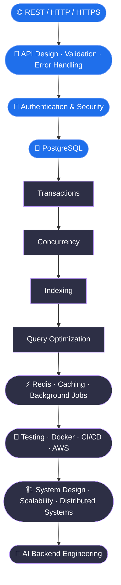

<!-- ═══════════════════════ HEADER BANNER ═══════════════════════ -->
<p align="center">
  
</p>
<p align="center">
  
</p>
<p align="center">
  
  
  
  
  
</p>
<p align="center">
  
  <a href="https://github.com/FD8-15?tab=followers"></a>
  <a href="https://github.com/FD8-15?tab=repositories"></a>
</p>
<!--
  Add your own links here, e.g.:
  <a href="https://www.linkedin.com/in/YOUR-HANDLE"></a>
  <a href="mailto:you@example.com"></a>
-->
 

## 👨‍💻 About Me
 
<table>
  <tr>
    <td width="60%" valign="top">
```yaml
name:       Raj Naik
role:       Backend Developer
studying:   Computer Science Engineering
focus:      Node.js • Express • REST APIs
databases:  PostgreSQL + MongoDB
interests:  Auth • Security • Scalable Systems
learning:   Database Optimization • System Design
motto:      Build • Learn • Debug • Improve
```
 
  </td>
  <td width="40%" valign="top">
* 🎓 CSE student
* 💻 Backend-first mindset
* 🚀 Shipping real-world projects
* 🔐 Obsessed with auth & security
* 🧠 Deep-diving into production engineering
  </td>
  </tr>
</table>

## 🛠️ Tech Stack
 
<div align="center">
| | |
|:--|:--|
| **⚙️ Backend** |  |
| **🗄️ Databases** |  |
| **🧰 Tools & Cloud** |  |
| **🧪 Testing** |   |
 
</div>

## 🚀 Featured Projects
 
<table>
  <tr>
    <td width="50%" valign="top">
### 🏢 SmartERP
*Multi-company ERP REST API for inventory, purchases, sales, payments and receipts.*
 
`Node.js` `Express 5` `PostgreSQL` `JWT` `Vitest` `Supertest`
 
* 🏢 Multi-company architecture
* 🔒 Company-level data isolation
* 👥 Role-based access control
* 📦 Inventory & stock management
* 🧾 Purchase & sales voucher workflows
* 💳 Payment & receipt management
* 🔄 PostgreSQL transactions
* 🧪 Integration tests (Vitest + Supertest)
<a href="https://github.com/FD8-15/SmartERP"></a>
 
  </td>
  <td width="50%" valign="top">
### 📍 Real-Time Service Booking
*Discover nearby services, manage bookings and get live updates.*
 
`Node.js` `Express` `MongoDB Atlas` `Mongoose` `Socket.IO` `JWT` `Cloudinary`
 
* 📍 Nearby service discovery
* 🔐 JWT authentication & authorization
* 📅 Booking management
* ⚡ Real-time updates via Socket.IO
* 🗄️ MongoDB Atlas integration
* ☁️ Cloudinary image uploads
* 🧩 Modular backend architecture
* 🛡️ Middleware-based request handling
<a href="https://github.com/FD8-15/real-time-service-booking-system"></a>
 
  </td>
  </tr>
</table>
<p align="center">
  <a href="https://github.com/FD8-15/SmartERP"></a>
  <a href="https://github.com/FD8-15/real-time-service-booking-system"></a>
</p>

## 📚 Learning Roadmap
 

 
<sub>🔵 Solid foundations &nbsp;•&nbsp; 🟣 In progress / up next</sub>
 

## 📊 GitHub Stats
 
<p align="center">
  
  
</p>
<p align="center">
  
</p>
<p align="center">
  
</p>
<p align="center">
  
</p>

## 🎯 Goal
 
<p align="center">
  <b>Build reliable backend systems, understand how production software works,<br/>and grow into a strong backend engineer.</b>
</p>
<p align="center">
  
</p>
<p align="center">
  
</p>
 
