<!--
  Profile README: every section is an SVG panel from /assets, stacked edge to edge
  so the black-hole scene continues from the first line to the last.
  To add links (LinkedIn, email, portfolio, live demos), see the notes at the bottom of this file.
-->
 

<!--
  ADDING YOUR OWN LINKS
  The panels are images, so links are added by wrapping a panel in <a href="...">...</a>.
  - Live demo for a project: wrap its  with the demo URL instead of (or in addition to) the repo link.
  - LinkedIn / email / portfolio: add a small badge row right after the contact panel, e.g.
      

        
        
      

-->
 
